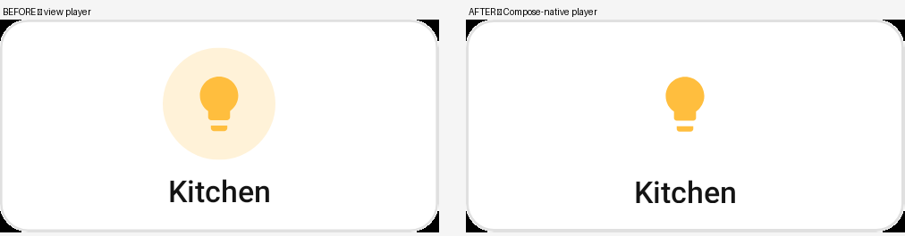
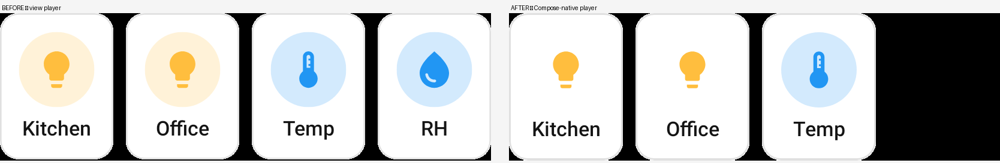
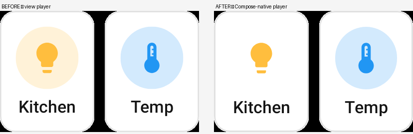
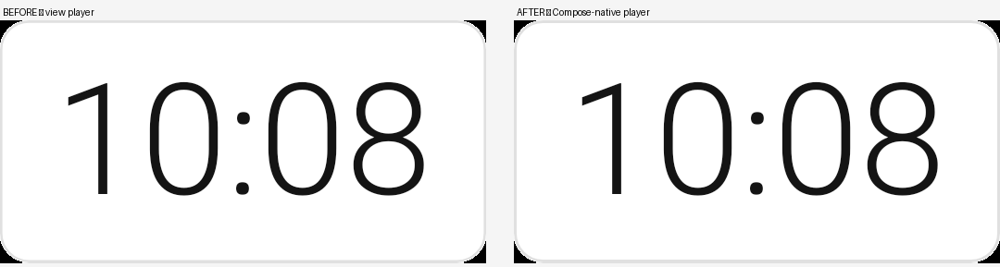

# Which player draws a preview

Every card in this repo is a **Remote Compose document**: `rc-converter` turns a
Home Assistant card config into RC operations, and something has to play those
operations back to produce pixels. Which "something" is a real choice, and for
previews it decides far more than the pixels.

## Two players

| | `remote-player-view` (`java`) | Compose-native (`cmp-android`) |
|---|---|---|
| What it is | an Android `View` painting to a framework `Canvas` | a Compose interpreter emitting layout/draw nodes |
| How it reaches Compose | `AndroidView { RemoteComposePlayer }` | composes directly |
| Compose tree for a whole card | one interop leaf | a node per RC component |
| Text | `Canvas.drawText` glyphs | real `Text` composables |

Both play the **same bytes**. The captured document is identical; only the
interpreter differs.

## Why the Compose-native player matters

A preview here is not just a PNG. The compose-ai-tools render harness derives a
stack of data products from the *composition* — the layout-inspector tree, the
semantics tree, and from those the `compose/figma-svg` vector export, the
semantics wireframe, and the accessibility tree.

Under the view player none of that survives. The card is one `AndroidView`
interop node, which the SVG exporter has on its opaque-component list, so the
whole card — type included — exports as a single `<image>`:

```xml
<g id="Root"><g id="ComposeNode">
  <image href="…/card-clock-light/….figma-raster/1372.png" x="0" y="0" width="525" height="262"/>
</g></g>
```

That is a screenshot wearing an `.svg` extension. A designer importing it into
Figma gets one flat bitmap; a diff against it can only say "some pixels moved".
Upstream tracked this as [compose-ai-tools#2937][2937].

Under the Compose-native player the same document composes into real nodes, so
the export carries editable text and the card's own geometry:

```xml
<text x="48" y="252.76" font-size="32" font-family="Roboto, sans-serif"
      font-weight="550" fill="#F6EDFF">Morning run</text>
```

Same reasoning applies to everything else derived from the composition: the
semantics tree describes the card instead of a black box.

[2937]: https://github.com/yschimke/compose-ai-tools/issues/2937

## Why it is not the default (yet)

Because it draws these cards wrong. An A/B over the whole preview set — 171 of
229 renders differ — found the Compose-native lane dropping non-text content the
view player gets right.

The tinted badge circle behind an "on"-state icon disappears. Note that the blue
sensor badge survives and the amber light-on badge does not, so this is a
specific paint path, not a blanket loss of icon backgrounds:



The grid card renders three of its four tiles, and loses two badges on the way:





Text-only cards are at parity:



This is the same class of gap [#2937][2937] measured on the reference catalog
(text survives, drawn content does not), still present for these cards. Trading a
flat-but-correct SVG for a vector one with missing content is not an improvement,
so the default stays on the view player. Flipping it is a one-line change in
`RcPreviewHost.kt` plus a re-render, once the player draws these correctly.

All 164 `.rc` sidecars were byte-identical across both lanes, which is the
control: the document is the same, only the interpreter differs.

## Where the choice lives

[`previews/…/RcPreviewHost.kt`](../../previews/src/main/kotlin/ee/schimke/ha/previews/RcPreviewHost.kt).
`HaRemoteContentPreview` is this module's replacement for upstream's
`RemoteContentPreview` — same capture, same content-sized measure path, but the
player is ours to pick. Every RC host in `:previews` goes through it, capturing
([`CapturingRemoteContentPreview`](../../previews/src/main/kotlin/ee/schimke/ha/previews/RcDocumentCapture.kt))
or not.

Selection, most specific first:

1. `renderNow.overrides.remoteCompose.player` from the compose-ai-tools daemon —
   what the preview server's `?rcPlayer=java` / `?rcPlayer=cmp-android` chips
   set. Read reflectively, so `:previews` neither compiles nor links against the
   connector and always observes the state the daemon actually seeded. **This is
   the way to get a live-text SVG out of a preview today.**
2. The `ha.rc.player` system property, which the `haRcPlayer` Gradle property
   sets — `previews/build.gradle.kts` forwards it onto the render task.
3. `HA_RC_PLAYER=<java|cmp-android>` in the environment.
4. The default: the view player.

If the embedded player isn't on the runtime classpath the host uses the view
player regardless, so the app and the IDE preview pane keep working without it.

To render the Compose-native lane for a visual diff, put it in
`gradle.properties`:

```properties
haRcPlayer=cmp-android
```

then `compose-preview render --module previews`.

**Getting this override to arrive is fiddly and fails silently.** Three ways
that look right and do not work:

| attempt | why it fails |
|---|---|
| `-Dha.rc.player=…` on the Gradle command line | the compose-preview plugin curates the render fork's system properties |
| `--gradle-arg -PhaRcPlayer=…` | not a CLI flag; ignored without error |
| `HA_RC_PLAYER=… compose-preview render` | the render fork inherits the *Gradle daemon's* environment, not the shell's, so it misses a warm daemon |

Each exits 0 and renders happily on the default lane. **If two lanes come out
byte-identical, assume the override did not arrive** — the players are not that
similar. Verify by printing `System.getProperty("ha.rc.player")` from
`rcPreviewPlayer()` and reading it back out of
`previews/build/test-results/composePreviewRender/TEST-*.xml`; the render fork's
stderr does not reach the CLI's stdout.

## What this does not change

- **The `.rc` sidecars, and everything downstream of them.** The published
  catalog's data tier is the captured document, which is byte-identical under
  either player. The browser JS lane and the PNG↔RC parity page are unaffected.
- **The app.** `CachedCardPreview` / `WrapAdaptiveRemoteDocumentPlayer` in
  `rc-converter` and `HaEmbeddedPlayer` in `rc-components-ui` are shipping code
  and stay on `remote-player-view`. `CardPreviewMatrix` deliberately renders
  through `CachedCardPreview` because its whole job is to show what the app and
  the launcher widgets do — switching its player would make it stop answering
  that question.
- **Widgets and Wear.** Those hosts are Glance/`RemoteComposePlayer` surfaces
  outside `:previews`.

So this is a statement about how previews are *observed*, not about how cards are
*played on a device*. If the two players ever disagree visually, that is a real
finding about one of them — compare the lanes with the `?rcPlayer=` chips on
[preview.coo.ee](https://preview.coo.ee/homeassistant-remotecompose/) rather than
assuming the default is right.
